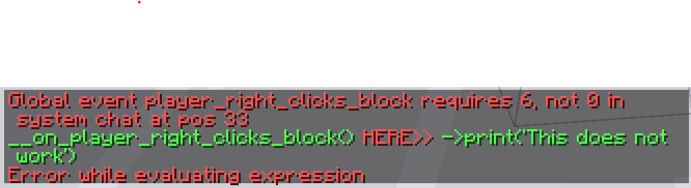

# Lesson 1 - Show bees count
### Script: [Show bees count](lesson_1_show_bees_count.sc)

***Foreword:***

*Welcome to the first scarpet tutorial lesson.
These lessons will be written assuming that the reader is familiar with basic programming concepts such as loops, conditional statements, and basic object-oriented programming.
Some more complicated programming operations will be explained if and when needed, in which case links to additional learning material will be provided.*

*Scarpet is a simple language, meaning anyone with a basic background in programming in Python, Javascript, Java, etc. should find it intuitive, but it should be easy to follow along even for those who know little about programming in general.*

*Please note that not all the scripts used in this series are exactly as they are in the scarpet app store.
For the purposes of demonstration, some minor details have been tweaked, and at times complexity removed in order to facilitate explanation and/or fix minor issues present in the scripts at time of writing/recording.*\
\
\
\
The first script that will be analysed for this series is `show_bees_count.sc`, by Crec0.
When this script is loaded, a player right-clicking on a beehive or a bee nest with an empty hand will receive a message telling them how many bees are currently contained in the block.
This is an incredibly simple script, which uses a basic scarpet event in order to give the player information about the world.

## Basic Event information
The event used in this case is `__on_player_right_clicks_block`, an event called, unsurprisingly, when the player right clicks a block. 
The way events in scarpet work is that the event is invoked via a function definition, so that when the event function is called, the body of the function as defined by the programmer is run by the scarpet API istelf.

In order for scarpet to recognize the event declaration, the event must have the correct number of arguments, in this case six arguments corresponding to:
- `player` - the player that clicked the block
- `item_tuple` - a list containing the count, item type, and nbt data of the item they were holding (in the form `[count, item, nbt]`)
- `hand` - the hand they used to click (`mainhand` or `offhand`)
- `block` - the block they clicked (the exact block in the world, so both the block info and its position)
- `face` - the face of the block that was hit
- `hitvec` - the exact position within the block that was clicked (this might be useful for seeing whether or not the player clicked the inner hitbox of a stair, or something)

Scarpet is a dynamically typed language, meaning you don't actually need to name the variables in the way described above.
You could just write `__on_player_right_clicks_block(a, b, c, d, e, f)`, and it would work exactly the same, but naming it is obviously more helpful.

**NB: If you do not have the correct number of variables, scarpet will give you the following error:**

## Script
Now, let us take a look at the script itself.
Within the `__on_player_right_clicks_block` event, there is a fairly long `if` statement, with four conditions connected by and (`&&`) operators, meaning they must all be true in order for the code within the `if` statement to run.
Within the `if` statment, a variable `num_bees` is declared which grabs the number of bees present within the beehive or bee nest block, and then the information is displayed to the player.

### **`if` statement**
The first condition checked in the `if` statement is `hand == 'mainhand'`.
This is a simple check to see if the `hand` variable, which is provided by the `__on_player_right_clicks_block` event, is equal to the string `'mainhand'`.
This essentially checks to see if the player is right clicking the block with their main hand.

The second condition checked in the `if` statement is `item_tuple == null`.
This is another simple check, which takes the `item_tuple` variable and checks if it is `null`, which is true if the player's hand is empty.

The third condition checked in the `if` statement is `player ~ 'sneaking'`.
This is a more complicated operation, which uses the entity API with the `~` operator, but essentially queries the `player` variable, which is an entity, and returns true if the player is sneaking.
**NB: The entity API will be covered in more detail later on in the series.**

The fourth and final condition checked in the `if` statement is `(block == 'beehive' || block == 'bee_nest')`.
These two separate statements check whether the `block` is equal to a `beehive` block or a `bee_nest` block respectively.
The `block` variable in this case is not a string, but a block variable, a separate type of value in the scarpet programming language.
However, when scarpet tries to use the `==` operator between a block variable and a string, it converts the block into its string form, or its block id, and compares that to the string.
This allows to easily check whether or not a block variable has a given block id.
The use of brackets means that this overall statement will return true if the block is a beehive or a bee nest (and it goes without saying that it can't be both).

### **`num_bees` variable declaration**
If all four of the above conditions are met, then the body of the `if` statement, contained in lines 7 and 8, will be run.
In line 7, a variable `num_bees` is declared, and assigned the value of `length(parse_nbt(block_data(block):'Bees'))`.

The innermost of these functions is the `block_data(block)` function, which simply returns any nbt data associated with the block, and `null` if there is none, which occurs if the block does not have a tile entity associated with it.

Next we have the `:'Bees'` operation, which returns a list of the bees withing the beehive or bee nest.
In scarpet, the `:` operator simply gets a member within a container.
For example, for a list `test_list=['A', 'B', 'C']`, the operation `test_list:1` will return `'B'`, as it is the second item in the list.
The `:'Bees'` operation, when applied to an nbt object such as the block data of the `block` variable, will return the contents of the nbt tag called `'Bees'` within the block data, and return `null` if no such object is found.
However, we have ascertained in the previous `if` statement that the block is a beehive or a bee nest, and both of these blocks have the `'Bees'` tag, to track which bees are currently occupying them.
This means that this operation will return the nbt list of all the bees within the block.

The next function is the `parse_nbt()` function, which converts nbt values to regular scarpet values.
This is because nbt is a data storage format used by the game, and so operations on nbt type values are more limited than operations on regular scarpet values.
The `parse_nbt()` function in this case surrounds the nbt list of bees within the block, thus converting it to a regular list of entities.

The final function in this chain is the `length()` function, which gives the length of the list of bees.
This gives the number of bees contained within the beehive or bee nest, and is a number, which gets assigned to the `num_bees` variable.

### **Displaying information to the player**
Once the `num_bees` variable has been declared, the information that was desired in the first place, it needs to be displayed to the player.
One of the simplest and most common ways of displaying information to the player is by way of the `print()` function, which prints messages to the server chat.

In line 8, the information regarding the number of bees is shown to the player: `print(player, str('%s at %s contains %d bees', title(block), pos(block), num_bees))`.
The first argument of the `print()` function is the `player` variable.
When the `print()` function is used with only one argument, the contents of that argument are printed out in string form for the whole server.
However, if a first argument is provided, it is interpreted as a player or list of players to whom the message should exclusively be sent.
In this case, using `player` as the first argument means that only the player who clicked the block will receive information about the number of bees inside it.

The second argument of the `print()` function is a `str()` function.
The `str()` function can be used to convert any variable into a string form (so `str(3.56)` returns `'3.56'` and `str(3.56e4)` returns `'3560.0'`).
In this case, with multiple variables, it treats the first argument, `'%s at %s contains %d bees'` as a formatted string, and replaces the `%s` and `%d` with the string values of the subsequent variables, in this case `title(block)`
(which returns the proper name of the block instead of its block id), `pos(block)` (which returns the coordinates of the block), and `num_bees`.
More information on formatted strings can be found in the Extra Materials secion below.

## Conclusion
Thank you for reading this exposition of how a simple scarpet app, with practiical survival applications, works.
The next lessons are intended to further explore the possibilities of what events can be made to do in scarpet, while hopefully familiarising the reader with basic syntax, allowing for the creation of new scarpet apps, taking advantage of features which may not always spring immediately to mind when designing apps.

## Extra materials:
 - Video link: 
 - Formatted strings: [Python String Formatting](https://www.learnpython.org/en/String_Formatting)

